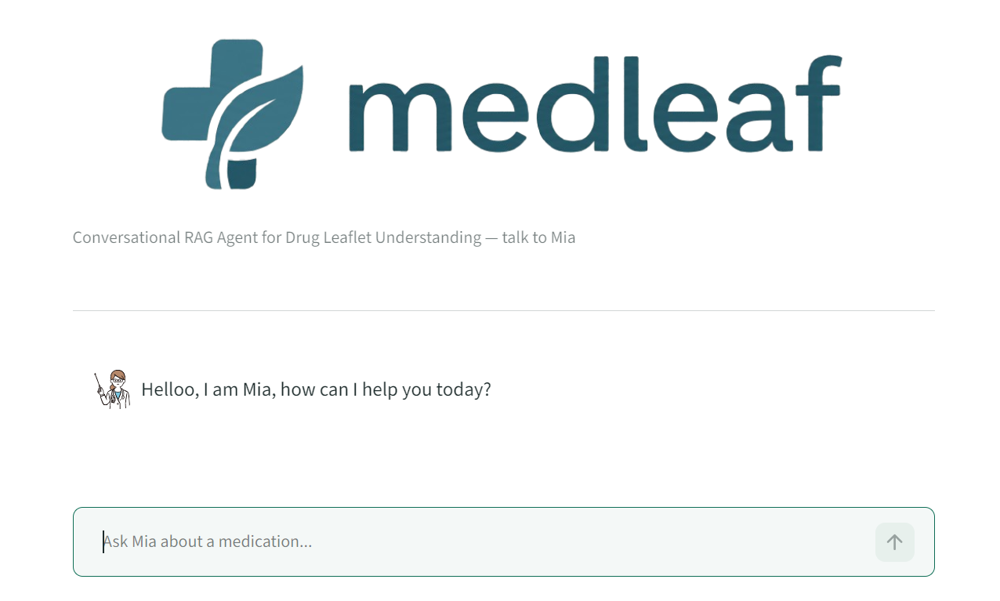

# MedLeaf RAG Application



## Project Description
MedLeaf is a research-oriented application for exploring drug leaflet content using retrieval-augmented generation (RAG). It combines a Streamlit user interface with a backend that:
- ingests drug text data,
- creates searchable chunks,
- stores them in a local vector database,
- and answers questions using AI-driven retrieval.

The app is intended to demonstrate how AI can assist with understanding and querying medical product information.

## Key Contributions
- Built the Streamlit interface in `app/app.py`
- Designed the `Rag` package to organize backend logic
- Implemented chunking and retrieval to connect user queries with relevant data
- Integrated AI tokenization support using `google-genai` and `sentencepiece`
- Configured Docker and Docker Compose for a reproducible runtime
- Resolved package import issues inside the Docker container
- Fixed dependency compatibility so the project can build cleanly in Docker

## Tools
- Python 3.12
- Streamlit
- Docker and Docker Compose
- Chroma vector database
- Google Gemini / `google-genai`
- `sentencepiece`
- `requirements.txt` dependency management

## How to Run the App with Docker
This project is designed to run with Docker only.

### Windows
1. Install Docker Desktop.
2. Open a terminal in the project root folder.
3. Run:
   ```powershell
docker compose up --build
   ```
4. Wait for the build to complete.
5. Open your browser and go to:
   ```text
   http://localhost:8501
   ```

### macOS / Linux
1. Install Docker Desktop (macOS) or Docker Engine / Docker Compose (Linux).
2. Open a terminal in the project root folder.
3. Run:
   ```bash
docker compose up --build
   ```
4. Wait for the build to complete.
5. Open your browser and go to:
   ```text
   http://localhost:8501
   ```

> If you prefer, you can stop the app with `Ctrl+C` in the terminal and then run `docker compose down`.


## Project Structure
- `app/app.py` — main Streamlit application
- `Dockerfile` — Docker image build definition
- `docker-compose.yml` — service configuration for Docker Compose
- `requirements.txt` — Python dependencies
- `Rag/` — implementation of agent, chunking, and retrieval logic
- `Vectordb/` — local vector database storage
- `files/` — source data files and utilities

## Highlights
This project is a strong example of:
- working with modern AI tooling and vector search,
- packaging a Python application for Docker,
- solving real-world dependency and import issues,
- and presenting a usable interface for non-technical reviewers.


