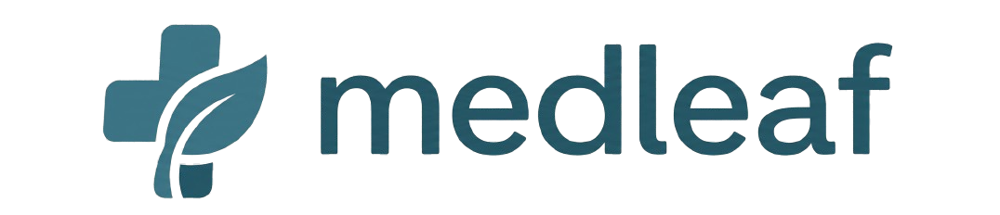

# MedLeaf Dockerized

MedLeaf is a Dockerized Streamlit application built to make medication leaflet information easier to explore, understand, and discuss. It combines a modern web interface with a retrieval-augmented generation (RAG) workflow so users can ask questions about medical documents, upload their own leaflets, and receive answers that are grounded in the actual source content.

What makes this project valuable is that it turns dense and often hard-to-read leaflet documents into an interactive experience. Instead of manually scanning long PDFs or text files, a user can simply ask questions and get relevant, document-based answers in a conversational way.



## Why this project matters
- It helps users interact with medical documents in a more intuitive way.
- It supports document-grounded answers instead of generic chatbot responses.
- It lets users upload their own files and build a custom knowledge base.
- It is fully containerized, making deployment and reuse much easier.

## App showcase
Here are the main screens that show how the application works in practice.

### Main interface


### Document upload flow


## What the application does
- Offers a multi-page Streamlit experience with dedicated sections for conversation, document upload, and project information
- Lets users ask questions about medication content through a chat-style assistant
- Allows users to upload PDF or TXT files and index them into the system
- Retrieves the most relevant document chunks before generating an answer
- Uses a Dockerized setup so the application is easy to run and share

## Technologies used
- Python 3.12+
- Streamlit for the interface
- Chroma vector database for semantic search and retrieval
- Google Gemini / `google-genai` for answer generation
- `python-dotenv` for environment management
- `fitz` for extracting text from PDF files
- Docker and Docker Compose for containerized deployment

## Prerequisites
Before running the app, make sure Docker is installed on your machine:
- Windows: Docker Desktop
- macOS: Docker Desktop
- Linux: Docker Engine + Docker Compose

You will also need a valid Gemini or Google API key for the AI generation part of the application.

## Quick start with Docker
From the project root, run the following command:

```bash
docker compose up --build
```

This will build the image and start the container. Once the application is running, open your browser at:

```text
http://localhost:8501
```

### Stop the application
To stop the running container, press:

```bash
Ctrl+C
```

If you want to stop and remove the container completely, run:

```bash
docker compose down
```

## Environment configuration
Create a file named `Rag/.env` and add your API key in one of the following formats:

```env
GEMINI_API_KEY=your_gemini_api_key_here
# or
GOOGLE_API_KEY=your_google_api_key_here
```

The Docker Compose configuration automatically loads this file through the `env_file` setting, so the application can access the credential at runtime.

## How the system works
1. A user uploads PDF or TXT documents through the Streamlit interface.
2. The uploaded files are processed and indexed into the Chroma vector database.
3. When a user submits a question, the system converts it into a semantic query.
4. The most relevant document chunks are retrieved from the database.
5. The Gemini-based agent generates a clear answer grounded in the retrieved content.

This makes the app more reliable than a general chatbot because the output is tied directly to the documents provided by the user.

## Project structure
The repository is organized as follows:
- `app/main.py` — the entry point that manages Streamlit navigation
- `app/app.py` — the conversational chat page for asking questions
- `app/pages/Upload_docs.py` — the page for uploading and indexing documents
- `app/pages/About_me.py` — the informational page about the project and author
- `Rag/` — the backend logic for chunking, retrieval, agent interaction, and database initialization
- `Vectordb/` — the persisted vector database storage mounted into the container
- `files/` — uploaded documents and support files mounted into the container
- `Dockerfile` and `docker-compose.yml` — container build and runtime configuration

## Notes
The Docker setup keeps your data persistent by mounting the local `Vectordb/` and `files/` folders into the container. This means your vector index and uploaded documents remain available even if the container is restarted.

- Python 3.12
- Streamlit
- Docker and Docker Compose
- Chroma vector database
- Google Gemini / google-genai
- sentencepiece
